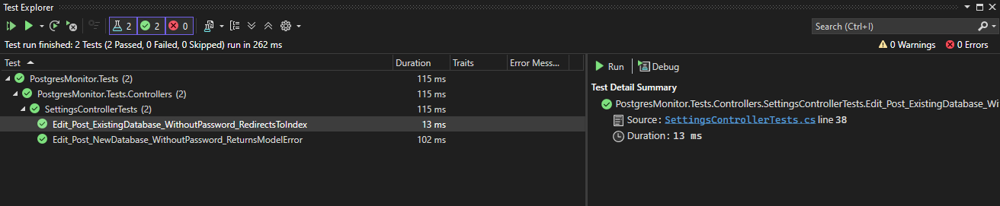

<div align="center">
  <h1>PostgresMonitor</h1>
  
  
  <p><b>PostgresMonitor is a lightweight, real-time health and performance monitoring dashboard for PostgreSQL databases. Built with ASP.NET Core MVC, it periodically collects telemetry data, stores it locally, and visualizes system trends without requiring complex external dependencies or monitoring agents.</b></p>
</div>

## Features Implemented

### Core Requirements
* **Database Telemetry:** Collects active connections and slow-running queries (executing for >2 seconds) directly via `pg_stat_activity`.
* **System Metrics:** Collects native OS CPU load and available RAM using Windows Performance Counters.
* **Local Storage:** Persists historical telemetry and database configurations to local JSON files (`metrics_history.json` and `app_settings.json`), capping history to prevent unbounded file growth.
* **Historical Inspection:** Displays a rolling history of the last 50 data points in a high-contrast data table.

### Bonus Features
* **Multi-Database Management:** Configure and store multiple database connection profiles and seamlessly toggle the active monitoring target.
* **Configurable Polling Intervals:** Users can select polling frequencies ranging from aggressive (5 seconds) to relaxed (60 seconds) directly from the UI.
* **Interactive Visualizations:** Implements Chart.js to render real-time line charts for connection concurrency, slow query latency, and system resource utilization.
* **Modern UI/UX:** Built with Bootstrap 5 featuring a custom high-contrast color palette and a dynamic Dark/Light mode toggle.

## Architecture Overview

The application follows a standard ASP.NET Core MVC architecture combined with a background worker pattern.

* **Controllers & Views:** `HomeController` serves the primary dashboard and historical data. `SettingsController` handles the CRUD operations for database configurations, including custom validation logic.
* **Background Service:** `MetricsCollectorBackgroundService` inherits from standard .NET `BackgroundService`. It runs independently of web requests, dynamically checking the active polling interval, executing the collection cycle, and sleeping.
* **Data Access (PostgreSQL):** `PostgresMetricsService` uses `Npgsql` to open transient connections to the database to execute lightweight aggregate queries. 
* **Data Access (OS):** Utilizes `System.Diagnostics.PerformanceCounter` to read host OS metrics. *(Note: This restricts full metric functionality to Windows environments).*
* **Storage Layer:** `MetricsStorageService` and `SettingsService` handle asynchronous serialization and deserialization of objects to local JSON files.

## Screenshots

<details open>
  <summary><strong>Dashboard (Light Mode)</strong></summary>
  
  
</details>

<details>
  <summary><strong>Dashboard (Dark Mode)</strong></summary>
  
  
</details>

<details>
  <summary><strong>Settings</strong></summary>
  
  
</details>

<details>
  <summary><strong>Edit</strong></summary>
  
  
</details>

## Setup and Installation

1. **Clone the repository:**
   ```bash
   git clone <repository-url>
   cd PostgresMonitor
   ```

2. **Build the solution:**
  ```bash
  dotnet build
  ```

3. **Run the web application:**
   ```bash
   dotnet run --project PostgresMonitor.Web
   ```

4. **Initial Configuration:**
    - Open a browser and navigate to `https://localhost:7240` (or the port provided in your terminal).
    - You will see a "Waiting for telemetry" message. Navigate to the Settings tab.
    - Click Add Database and provide your PostgreSQL host, port, database name, and credentials.
    - Set the new Database as active by clicking the icon.
    - Once saved, the background service will automatically begin polling your database at the configured interval.

## Testing
The project includes an xUnit test suite (`PostgresMonitor.Tests`) that utilizes Moq to isolate and verify controller logic, specifically focusing on edge cases in the configuration validation pipeline.

To run the test suite:
```bash
dotnet test
```


